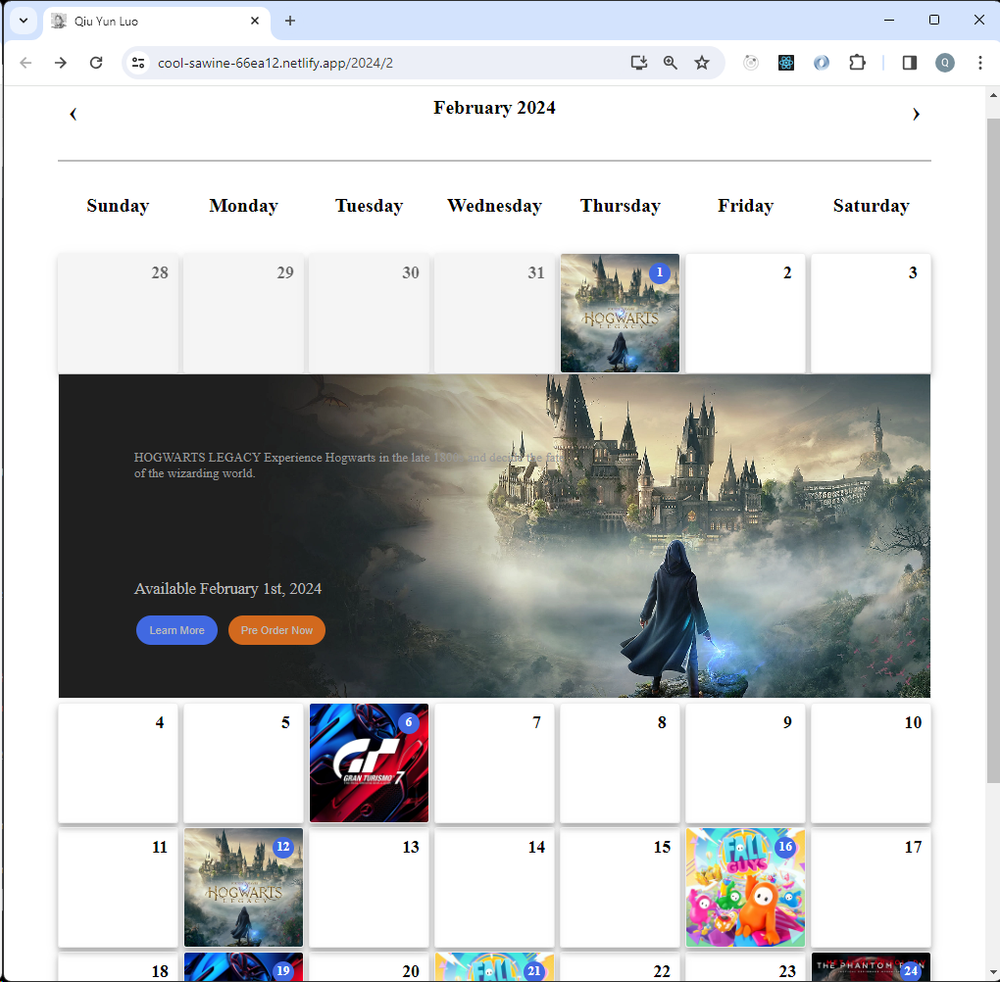

# React v18 Dynamic Events Calendar
[Luo, Qiu Yun](https://cool-sawine-66ea12.netlify.app/)

This is to create a calendar UI of a calendar application 
that displays upcoming video games launches. [Google Share Link](https://drive.google.com/drive/folders/1PtpkEH0ysG5HvHpdPKjzr0ZrV30At9X3?usp=sharing)

#
## App Features

- URL driven dynamic events calendar in a "Monthly" view
- Provide 'Previous' and 'Next' buttons to allow navigation between months
- Visiting an invalid date (pathname) will be redirected to the current date
- client-side algorithm for events placement within the calendar cells
- Clicking on a calendar event opens a simple view showing details of the event
- react.js
- react router
- typescript
- CSS Grid
- unit testing
- JAMstack Serverless with Netlify function API services

The above features were implemented in order to compliant to the assignment requirments:
- Mastery of React/JavaScript/TypeScript, HTML, CSS, and other aspects of UI 

### [DEMO](https://cool-sawine-66ea12.netlify.app/)

- https://cool-sawine-66ea12.netlify.app/

- https://cool-sawine-66ea12.netlify.app/2023/12

- https://cool-sawine-66ea12.netlify.app/2025/2

## Screenshots

# Getting Started with Create React App

This is a [React](https://reactjs.org/) project bootstrapped with [Create React App](https://github.com/facebook/create-react-app) and structured/developed by Qiu Yun Luo.

For this app, I made use of react.js and Serverless pattern with Netlify to create a Dynamic Events Calendar application that takes in pre-defined game events and generate a monthly calendar with events randomly attached to days that are also randomly choosen.  Test it out [here](https://cool-sawine-66ea12.netlify.app/).

## Available Scripts

In the project directory, you can run:

### `yarn`

Installs the dependencies.

### `yarn start`

Runs the app in the development mode. 
Open [http://localhost:3000](http://localhost:3000) to view it in the browser.

The page will reload if you make edits. 
You will also see any lint errors in the console.

### `yarn test`

Launches the test runner in the interactive watch mode. 
See the section about [running tests](https://facebook.github.io/create-react-app/docs/running-tests) for more information.

### `yarn build`

Builds the app for production to the `build` folder. 
It correctly bundles React in production mode and optimizes the build for the best performance.

The build is minified and the filenames include the hashes. 
Your app is ready to be deployed!

See the section about [deployment](https://facebook.github.io/create-react-app/docs/deployment) for more information.

### `yarn eject`

**Note: this is a one-way operation. Once you `eject`, you can’t go back!**

If you aren’t satisfied with the build tool and configuration choices, you can `eject` at any time. This command will remove the single build dependency from your project.

Instead, it will copy all the configuration files and the transitive dependencies (webpack, Babel, ESLint, etc) right into your project so you have full control over them. All of the commands except `eject` will still work, but they will point to the copied scripts so you can tweak them. At this point you’re on your own.

You don’t have to ever use `eject`. The curated feature set is suitable for small and middle deployments, and you shouldn’t feel obligated to use this feature. However we understand that this tool wouldn’t be useful if you couldn’t customize it when you are ready for it.

## Learn More

You can learn more in the [Create React App documentation](https://facebook.github.io/create-react-app/docs/getting-started).

To learn React, check out the [React documentation](https://reactjs.org/).

### Code Splitting

This section has moved here: https://facebook.github.io/create-react-app/docs/code-splitting

### Analyzing the Bundle Size

This section has moved here: https://facebook.github.io/create-react-app/docs/analyzing-the-bundle-size

### Making a Progressive Web App

This section has moved here: https://facebook.github.io/create-react-app/docs/making-a-progressive-web-app

### Advanced Configuration

This section has moved here: https://facebook.github.io/create-react-app/docs/advanced-configuration

### Deployment

This section has moved here: https://facebook.github.io/create-react-app/docs/deployment

### `yarn build` fails to minify

This section has moved here: https://facebook.github.io/create-react-app/docs/troubleshooting#npm-run-build-fails-to-minify
